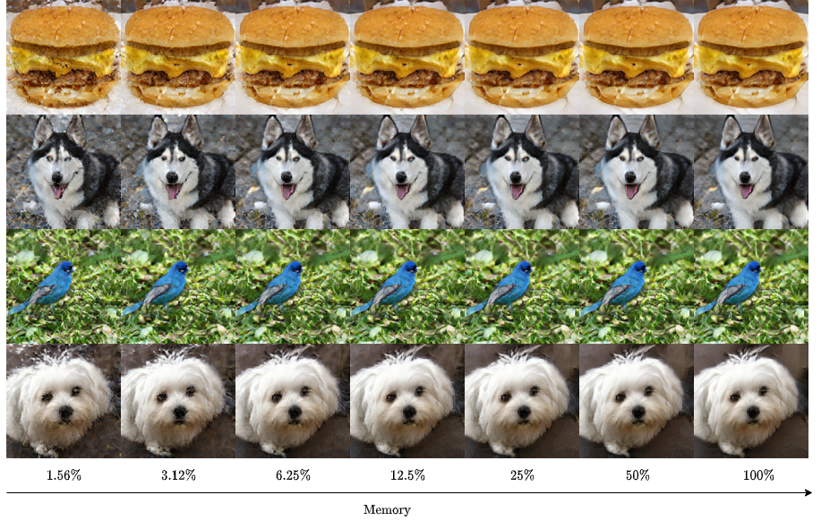
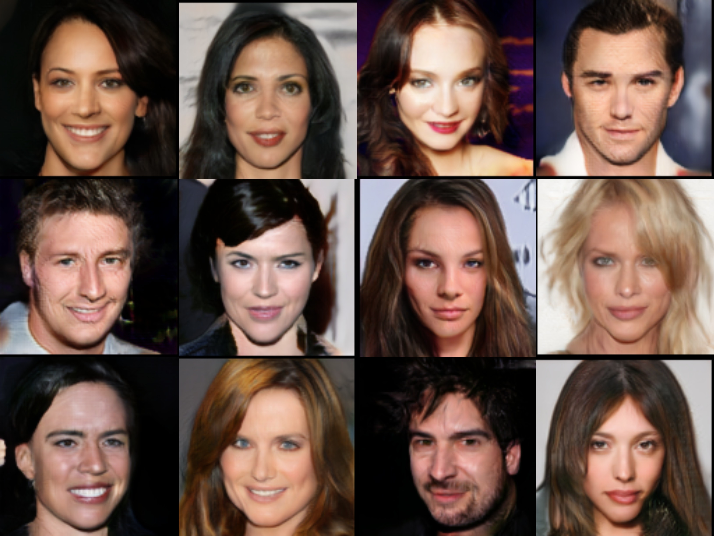

  

## SMYRF: Efficient attention using asymmetric clustering

Get started: 

### Abstract
> We propose a novel type of balanced clustering algorithm to approximate attention. Attention complexity is reduced from O(N^2) to O(NlogN), where N is the sequence length. Our algorithm, SMYRF, uses Locality Sensitive Hashing (LSH) in a novel way by defining new Asymmetric transformations and an adaptive scheme that produces balanced clusters. The biggest advantage of SMYRF is that it can be used as a drop-in replacement for dense attention layers *without any retraining*.
On the contrary, prior fast attention methods impose constraints (e.g. tight queries and keys) and require re-training from scratch. We apply our method to pre-trained state-of-the-art Natural Language Processing and Computer Vision models and we report significant memory and speed benefits. Notably, SMYRF-BERT outperforms (slightly) BERT on GLUE, while using $50\%$ less memory. We also show that SMYRF can be used interchangeably with dense attention before and after training. Finally, we use SMYRF to train GANs with attention in high resolutions. Using a single TPU, we train BigGAN on Celeba-HQ, with attention at resolution 128x128 and 256x256, capable of generating realistic human faces.

### Results

#### Memory-quality trade-off

#### GLUE benchmark
<table>
<thead>
<tr class="header">
<th style="text-align: left;"></th>
<th style="text-align: left;">Avg.</th>
<th style="text-align: left;">#</th>
<th style="text-align: left;"><em>C</em></th>
<th style="text-align: left;">CoLA</th>
<th style="text-align: left;">MNLI-m/mm</th>
<th style="text-align: left;">MRPC</th>
<th style="text-align: left;">QNLI</th>
<th style="text-align: left;">QQP</th>
<th style="text-align: left;">RTE</th>
<th style="text-align: left;">SST-2</th>
<th style="text-align: left;">STS-B</th>
</tr>
</thead>
<tbody>
<tr class="odd">
<td style="text-align: left;">BERT<em></em>128</td>
<td style="text-align: left;">82.69</td>
<td style="text-align: left;">1</td>
<td style="text-align: left;">1</td>
<td style="text-align: left;">57.83</td>
<td style="text-align: left;"><strong>84.43</strong><strong>/</strong><strong>84.68</strong></td>
<td style="text-align: left;"><strong>88.41</strong></td>
<td style="text-align: left;"><strong>91.31</strong></td>
<td style="text-align: left;">89.70</td>
<td style="text-align: left;">65.70</td>
<td style="text-align: left;"><strong>93.46</strong></td>
<td style="text-align: left;">88.73</td>
</tr>
<tr class="even">
<td style="text-align: left;">SMYRF-BERT<em></em>2x32</td></td>
<td style="text-align: left;"><strong>82.98</strong></td>
<td style="text-align: left;">2</td>
<td style="text-align: left;">32</td>
<td style="text-align: left;">58.79</td>
<td style="text-align: left;">83.76/84.27</td>
<td style="text-align: left;">87.69</td>
<td style="text-align: left;">91.14</td>
<td style="text-align: left;"><strong>89.72</strong></td>
<td style="text-align: left;"><strong>68.59</strong></td>
<td style="text-align: left;">93.23</td>
<td style="text-align: left;"><strong>89.65</strong></td>
</tr>
<tr class="odd">
<td style="text-align: left;">SMYRF-BERT<em></em>2x16</td></td>
<td style="text-align: left;">81.74</td>
<td style="text-align: left;">2</td>
<td style="text-align: left;">16</td>
<td style="text-align: left;"><strong>58.90</strong></td>
<td style="text-align: left;">82.86/83.49</td>
<td style="text-align: left;">85.72</td>
<td style="text-align: left;">89.53</td>
<td style="text-align: left;">89.33</td>
<td style="text-align: left;">64.98</td>
<td style="text-align: left;">93.12</td>
<td style="text-align: left;">87.75</td>
</tr>
<tr class="even">
<td style="text-align: left;">BERT<em></em>64</td>
<td style="text-align: left;">81.57</td>
<td style="text-align: left;">1</td>
<td style="text-align: left;">64</td>
<td style="text-align: left;">58.80</td>
<td style="text-align: left;">82.34/82.47</td>
<td style="text-align: left;">87.02</td>
<td style="text-align: left;">90.48</td>
<td style="text-align: left;">89.69</td>
<td style="text-align: left;">61.73</td>
<td style="text-align: left;">93.00</td>
<td style="text-align: left;">88.64</td>
</tr>
<tr class="odd">
<td style="text-align: left;">BERT<em></em>32</td>
<td style="text-align: left;">73.56</td>
<td style="text-align: left;">1</td>
<td style="text-align: left;">32</td>
<td style="text-align: left;">56.40</td>
<td style="text-align: left;">64.51/63.41</td>
<td style="text-align: left;">77.89</td>
<td style="text-align: left;">79.81</td>
<td style="text-align: left;">88.59</td>
<td style="text-align: left;">55.23</td>
<td style="text-align: left;">92.66</td>
<td style="text-align: left;">83.53</td>
</tr>
</tbody>
</table>

#### Interchangeability of SMYRF and dense attention
Results on IMDB dataset. Using dense attention on inference consistently improves results, nearly matching dense attention perf.

|               | Memory  | SMYRF Inference | Accuracy        |
|---------------|--------:|----------------:|----------------:|
| RoBERTa       |  100%   | &#9746;         | 94.96%          |
| SMYRF-RoBERTa |  50%    | &#x2612;        | 93.72%          |
| SMYRF-RoBERTa |  50%    | &#x2611;        | 94.62%          |
| BERT          |  100%   | &#x2612;        | 94.12%          |
| SMYRF-BERT    |  50%    | &#x2612;        | 92.64%          |
| SMYRF-BERT    |  50%    | &#x2611;        | 93.54%          |

#### Smyrf-BigGAN training on Celeba-HQ-128
Generated faces by a Smyrf-BigGAN trained on 128x128 resolution with attention at 128x128, using 50% of dense memory.

Results after 120k iterations:

|              | Resolution | Attention | # | C    | FID   |
|--------------|------------|-----------|---|------|-------|
| BigGAN       | 128x128    | 64x64     | 1 | 4096 | 26.06 |
| Smyrf-BigGAN | 128x128    | 128x128   | 4 | 2048 | **25.03** |

where \# denotes number of hashes and C number of queries per cluster.

### What's here
The code hosted in this repository is the one we used to run all the experiments in the paper.
Get started: 

For a deeper dive, look at the `examples/` folder where we have code for pre-training SMYRF-BigGAN, sampling from a pre-trained BigGAN with SMYRF, finetuning state-of-the-art NLP models with SMYRF and a lot more.
